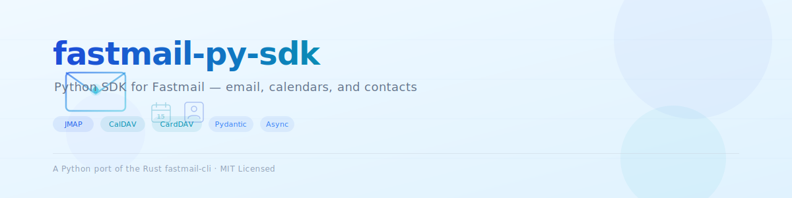

<p align="center">
  <picture>
    <source media="(prefers-color-scheme: dark)" srcset="assets/header.svg">
    
  </picture>
</p>

<p align="center">
  <a href="https://pypi.org/project/fastmail-py-sdk/"></a>
  <a href="https://github.com/kwhatcher/fastmail-py-sdk/actions"></a>
  <a href="LICENSE"></a>
  <a href="https://pypi.org/project/fastmail-py-sdk/"></a>
</p>

**fastmail-py-sdk** is an async Python SDK for the
[Fastmail](https://www.fastmail.com/) platform, providing first-class clients for
email ([JMAP](https://www.rfc-editor.org/rfc/rfc8620.html)), calendars
([CalDAV](https://datatracker.ietf.org/doc/html/rfc4791)), and contacts
([CardDAV](https://datatracker.ietf.org/doc/html/rfc6352)). It's a faithful port
of the Rust [fastmail-cli](https://github.com/kwhatcher/fastmail-cli) tool, with
[Pydantic](https://docs.pydantic.dev/)-typed domain models,
[RFC 5545](https://datatracker.ietf.org/doc/html/rfc5545)-compliant iCalendar
round-tripping, and ETag-based optimistic concurrency throughout.

## ✨ Features

- **📧 JMAP email** — list, search, send, reply, forward, move, mark read/spam,
  download attachments, and manage
  [masked email](https://www.fastmail.com/help/technical/maskedemail.html)
  addresses
- **📅 CalDAV calendars** — discover, create, update, and delete calendars;
  full CRUD for events with
  [attendees](https://datatracker.ietf.org/doc/html/rfc5545#section-3.8.4.1),
  [recurrences](https://datatracker.ietf.org/doc/html/rfc5545#section-3.8.5),
  and [reminders](https://datatracker.ietf.org/doc/html/rfc5545#section-3.8.6)
- **👤 CardDAV contacts** — list, search, create, update, and delete
  [vCard 4.0](https://datatracker.ietf.org/doc/html/rfc6350) contacts;
  manage contact groups with member add/remove
- **🔄 iCalendar parsing** — hand-rolled [RFC 5545](https://datatracker.ietf.org/doc/html/rfc5545)
  parser and serializer that handles Fastmail's iCalendar dialect, with
  [`icalendar`](https://pypi.org/project/icalendar/) library fallback
- **🛡️ Optimistic concurrency** — ETag-based conflict detection on every write,
  matching the [Rust CLI](https://github.com/kwhatcher/fastmail-cli)'s durability
  guarantees
- **⚡ Partial-failure tolerance** — concurrent per-calendar/address-book fetches
  using [asyncio.gather](https://docs.python.org/3/library/asyncio-task.html#asyncio.gather)
  that log and skip individual failures instead of aborting
- **🔑 Credential compatibility** — reads credentials from env vars or the
  Rust [`fastmail-cli`](https://github.com/kwhatcher/fastmail-cli)
  [config file](https://github.com/kwhatcher/fastmail-cli#configuration)
  (`~/.config/fastmail-cli/config.toml`)
- **🧪 Tested** — [respx](https://github.com/lundberg/respx)-powered HTTP
  mocking ensures the full test suite runs without a Fastmail account
- **🐍 Fully typed** — [Pydantic v2](https://docs.pydantic.dev/) models with
  `camelCase` aliases for seamless [JMAP](https://www.rfc-editor.org/rfc/rfc8620.html)
  API round-tripping

## 🚀 Quick Start

```bash
# Install
uv add fastmail-py-sdk

# Or with pip
pip install fastmail-py-sdk
```

```python
import asyncio
from fastmail_sdk import JmapClient, CalDavClient, load_credentials

# --- JMAP (email) ---
async def check_inbox():
    async with JmapClient(token="YOUR_API_TOKEN") as client:
        await client.authenticate()
        inbox = await client.find_mailbox("inbox")
        emails = await client.list_emails(inbox.id, limit=5)
        for email in emails:
            print(email.subject, "-", email.from_[0].email if email.from_ else "unknown")

# --- CalDAV (calendars) ---
async def list_events():
    username, app_password = load_credentials()
    async with CalDavClient(username, app_password) as client:
        calendars = await client.list_calendars()
        for cal in calendars:
            print(f"📅 {cal.name} ({cal.id})")

asyncio.run(check_inbox())
```

## 📖 Table of Contents

- [Installation](#-installation)
- [Why fastmail-py-sdk?](#-why-fastmail-py-sdk)
- [Usage](#-usage)
  - [JMAP — Email](#jmap--email)
  - [CalDAV — Calendars](#caldav--calendars)
  - [CardDAV — Contacts](#carddav--contacts)
- [API Reference](#-api-reference)
- [Contributing](#-contributing)
- [License](#-license)
- [Acknowledgements](#-acknowledgements)

## 📦 Installation

### With uv (recommended)

[uv](https://docs.astral.sh/uv/) is a fast Python package manager.

```bash
uv add fastmail-py-sdk
```

### With pip

```bash
pip install fastmail-py-sdk
```

### From source

```bash
git clone https://github.com/kwhatcher/fastmail-py-sdk.git
cd fastmail-py-sdk
uv sync
```

**Requires [Python 3.13+](https://www.python.org/downloads/).**

## 💡 Why fastmail-py-sdk?

Fastmail offers three API surfaces —
[JMAP](https://www.rfc-editor.org/rfc/rfc8620.html) for email,
[CalDAV](https://datatracker.ietf.org/doc/html/rfc4791) for calendars, and
[CardDAV](https://datatracker.ietf.org/doc/html/rfc6352) for contacts — each
with different authentication, request formats, and data models. This SDK
unifies them under a single, consistent Pythonic interface.

- **No more hand-rolling XML**. The CalDAV and CardDAV clients handle
  [PROPFIND](https://datatracker.ietf.org/doc/html/rfc4918#section-9.1),
  [REPORT](https://datatracker.ietf.org/doc/html/rfc3253#section-3.6),
  [MKCALENDAR](https://datatracker.ietf.org/doc/html/rfc4791#section-5.3.1),
  and [PROPPATCH](https://datatracker.ietf.org/doc/html/rfc4918#section-9.2)
  requests for you.
- **No more manual iCalendar parsing**. The `ical` module handles
  [RFC 5545](https://datatracker.ietf.org/doc/html/rfc5545) line folding,
  escaping, datetimes, attendees, recurrences, and VALARM reminders.
- **No more raw dict wrangling**. Every API response is parsed into a typed
  [Pydantic](https://docs.pydantic.dev/) model with fields you can autocomplete.
- **Drop-in compatible with the Rust CLI**. If you already use
  [fastmail-cli](https://github.com/kwhatcher/fastmail-cli), your
  [credential config file](https://github.com/kwhatcher/fastmail-cli#configuration)
  works without changes.

## 🔧 Usage

All clients are async context managers built on
[httpx](https://www.python-httpx.org/). Create them with `async with` for
automatic connection lifecycle.

### JMAP — Email

Authenticate with a [Fastmail API token](https://app.fastmail.com/settings/security/tokens).

```python
import asyncio
from fastmail_sdk import JmapClient, EmailAddress, SearchFilter

async def main():
    async with JmapClient(token="YOUR_API_TOKEN") as client:
        await client.authenticate()

        # List mailboxes
        mailboxes = await client.list_mailboxes()
        for m in mailboxes:
            print(f"📁 {m.name}: {m.unread_emails} unread")

        # Find the inbox and list recent emails
        inbox = await client.find_mailbox("inbox")
        emails = await client.list_emails(inbox.id, limit=10)
        for e in emails:
            print(f"  {e.subject} ({e.received_at})")

        # Send an email
        await client.send_email(
            to=[EmailAddress(email="friend@example.com", name="Friend")],
            subject="Hello from Python 🐍",
            body="This was sent programmatically via JMAP.",
        )

        # Search
        results = await client.search_emails(
            SearchFilter(text="invoice", unread=True),
            mailbox_id=inbox.id,
            limit=5,
        )
        print(f"Found {len(results)} matching emails")

        # Get full email with body
        if results:
            full = await client.get_email(results[0].id)
            print(full.text_content())

asyncio.run(main())
```

<details>
<summary><strong>More JMAP operations</strong></summary>

**Reply and forward**

```python
# Reply to an email
await client.reply_email(
    original=email,
    body="Thanks for the update!",
    reply_all=True,
)

# Forward an email
await client.forward_email(
    original=email,
    to=[EmailAddress(email="colleague@example.com")],
    body="FYI — see below",
)
```

**Move and mark**

```python
archive = await client.find_mailbox("archive")
await client.move_email(email_id, archive.id)

await client.set_keywords(email_id, {"$seen": True})
await client.mark_spam(email_id)
```

**Masked email**

```python
masked = await client.create_masked_email(
    for_domain="example.com",
    description="Newsletter signup",
)
print(f"Created: {masked.email}")

all_masked = await client.list_masked_emails()
for m in all_masked:
    print(f"{m.email} — {m.state}")
```

**Download attachments**

```python
email = await client.get_email(email_id)
for att in (email.attachments or []):
    if att.blob_id:
        data = await client.download_blob(att.blob_id)
        with open(att.name or "attachment", "wb") as f:
            f.write(data)
```

</details>

### CalDAV — Calendars

Authenticate with your Fastmail email and an
[app password](https://app.fastmail.com/settings/security/apppasswords).
The [CalDAV protocol](https://datatracker.ietf.org/doc/html/rfc4791) communicates
over XML; the client handles all [PROPFIND](https://datatracker.ietf.org/doc/html/rfc4918#section-9.1)
and [REPORT](https://datatracker.ietf.org/doc/html/rfc3253#section-3.6)
requests internally.

```python
import asyncio
from fastmail_sdk import CalDavClient, load_credentials
from fastmail_sdk.models.event import EventQuery

async def main():
    username, app_password = load_credentials()
    async with CalDavClient(username, app_password) as client:
        # List all calendars
        calendars = await client.list_calendars()
        for cal in calendars:
            marker = "⭐" if cal.is_default else "  "
            print(f"{marker} {cal.name} — {cal.color}")

        # List today's events
        from fastmail_sdk.ical import default_today_range
        start, end = default_today_range()
        events = await client.list_events(EventQuery(start=start, end=end))
        for event in events:
            print(f"  {event.title}: {event.start.value} → {event.end.value}")

        # Fetch a specific event
        event = await client.get_event_by_id("event-uid-here")
        print(f"Found: {event.title} in {event.calendar_name}")

asyncio.run(main())
```

<details>
<summary><strong>Event CRUD and calendar management</strong></summary>

**Create, update, and delete events**

```python
from fastmail_sdk.models.event import EventCreate, CalendarEvent, EventDateTime

# Create an event
default = await client.default_calendar()
created = await client.create_event(
    calendar_id=default.id,
    event=CalendarEvent(
        id="generate-a-uuid",
        calendar_id=default.id,
        title="Team Standup",
        start=EventDateTime(value="2025-01-15T09:00:00", timezone="America/New_York"),
        end=EventDateTime(value="2025-01-15T09:30:00", timezone="America/New_York"),
        location="Conference Room B",
        attendees=[EventAttendee(email="alice@example.com", name="Alice")],
        reminders=[EventReminder(minutes_before=-10)],
    ),
)

# Update (requires the current ETag)
created.title = "Team Standup (extended)"
updated = await client.update_event(created, created.etag)

# Delete
await client.delete_event(updated)
```

**Calendar management**

```python
# Create a new calendar
new_cal = await client.create_calendar("Work Projects", color="#3a87ad")

# Update calendar display name
updated_cal = await client.update_calendar(new_cal, name="Work (Active)")

# Delete a calendar
await client.delete_calendar(updated_cal)
```

**iCalendar round-tripping**

```python
from fastmail_sdk.ical import serialize_ical_event, build_event_uid

# Serialize any event to valid iCalendar text
ical_text = serialize_ical_event(event)
print(ical_text)

# Generate a new event UID
uid = build_event_uid()
```

</details>

### CardDAV — Contacts

```python
import asyncio
from fastmail_sdk import CardDavClient, load_credentials
from fastmail_sdk.models.contacts import Contact, ContactEmail

async def main():
    username, app_password = load_credentials()
    async with CardDavClient(username, app_password) as client:
        # List address books
        books = await client.list_addressbooks()
        default_book = books[0].href

        # List all contacts
        contacts = await client.list_contacts(default_book)
        for c in contacts:
            emails = ", ".join(e.email for e in c.emails)
            print(f"{c.name}: {emails}")

        # Search contacts
        results = await client.search_contacts("Alice")
        for c in results:
            print(f"Found: {c.name} — {c.organization}")

asyncio.run(main())
```

<details>
<summary><strong>Contact and group management</strong></summary>

**Create, update, and delete contacts**

```python
import uuid

# Create a contact
result = await client.create_contact(
    default_book,
    contact=Contact(
        id=str(uuid.uuid4()),
        name="Jane Smith",
        emails=[ContactEmail(email="jane@example.com", label="work")],
        organization="Acme Corp",
        title="Engineer",
    ),
)

# Update
contact = await client.get_contact_by_id("contact-uid")
contact.notes = "Met at PyCon 2025"
new_etag = await client.update_contact(contact.href, contact.etag, contact)

# Delete
await client.delete_contact(contact.href, contact.etag, contact.id)
```

**Contact groups**

```python
from fastmail_sdk.models.contacts import ContactGroup

# List groups
groups = await client.list_groups()

# Create a group
group = ContactGroup(id=str(uuid.uuid4()), name="Project Team")
result = await client.create_group(default_book, group)

# Add and remove members
etag = await client.add_group_member(  # Returns new ETag
    result.href, result.etag, group, "contact-uid"
)
etag = await client.remove_group_member(
    result.href, etag, group, "contact-uid"
)
```

</details>

## 📚 API Reference

### Clients

| Client | Protocol | Authentication | Base URL |
|--------|----------|----------------|----------|
| `JmapClient` | JMAP (JSON) | API token | `https://api.fastmail.com/jmap/session` |
| `CalDavClient` | CalDAV (XML) | App password | `https://caldav.fastmail.com` |
| `CardDavClient` | CardDAV (XML) | App password | `https://carddav.fastmail.com` |

### Models

| Model | Module | Description |
|-------|--------|-------------|
| `Email`, `Mailbox`, `Identity`, `MaskedEmail` | `models.email` | JMAP email domain objects |
| `Calendar`, `CalendarEvent`, `EventQuery` | `models.calendar`, `models.event` | CalDAV calendar domain objects |
| `Contact`, `ContactGroup`, `AddressBook` | `models.contacts` | CardDAV contact domain objects |

### Error Types

| Exception | When |
|-----------|------|
| `FastmailError` | Base exception — all SDK errors inherit from this |
| `NotAuthenticated` | Missing or invalid credentials |
| `CalendarNotFound` / `EventNotFound` | Requested resource doesn't exist |
| `CalendarConflict` / `EventConflict` | ETag mismatch — someone else modified the resource |

### Utilities

| Function | Description |
|----------|-------------|
| `load_credentials()` | Read username/app_password from env or config file |
| `parse_ical_event()` | Parse iCalendar text into a `CalendarEvent` |
| `serialize_ical_event()` | Serialize a `CalendarEvent` to iCalendar text |
| `build_event_uid()` | Generate a UUID v4 for new events |
| `default_today_range()` / `current_week_range()` | Convenience date ranges for event queries |

## 🤝 Contributing

We welcome contributions! See [CONTRIBUTING.md](CONTRIBUTING.md) for
[development setup](CONTRIBUTING.md#development-setup),
[code style](CONTRIBUTING.md#code-style), and the
[pull request process](CONTRIBUTING.md#pull-request-process).

Tests use [pytest](https://docs.pytest.org/) with
[respx](https://github.com/lundberg/respx) for HTTP mocking — no Fastmail
account required:

```bash
uv run pytest
```

<a href="https://github.com/kwhatcher/fastmail-py-sdk/graphs/contributors">
  
</a>

This project follows the
[Contributor Covenant](CODE_OF_CONDUCT.md) code of conduct.

## 💬 Getting Help

- [GitHub Issues](https://github.com/kwhatcher/fastmail-py-sdk/issues) — bug
  reports and feature requests
- [GitHub Discussions](https://github.com/kwhatcher/fastmail-py-sdk/discussions) —
  questions, ideas, and community chat
- [SECURITY.md](SECURITY.md) — vulnerability reporting (private channel)

## 📄 License

MIT © 2025 The fastmail-py-sdk Authors. See [LICENSE](LICENSE) for details.

## 🙏 Acknowledgements

- [fastmail-cli](https://github.com/kwhatcher/fastmail-cli) — the Rust CLI
  whose battle-tested logic this SDK ports
- [httpx](https://www.python-httpx.org/) — the async HTTP library powering all
  three clients
- [Pydantic](https://docs.pydantic.dev/) — the data validation layer behind
  every domain model
- [icalendar](https://pypi.org/project/icalendar/) — used as a structural
  parsing fallback in the iCalendar module